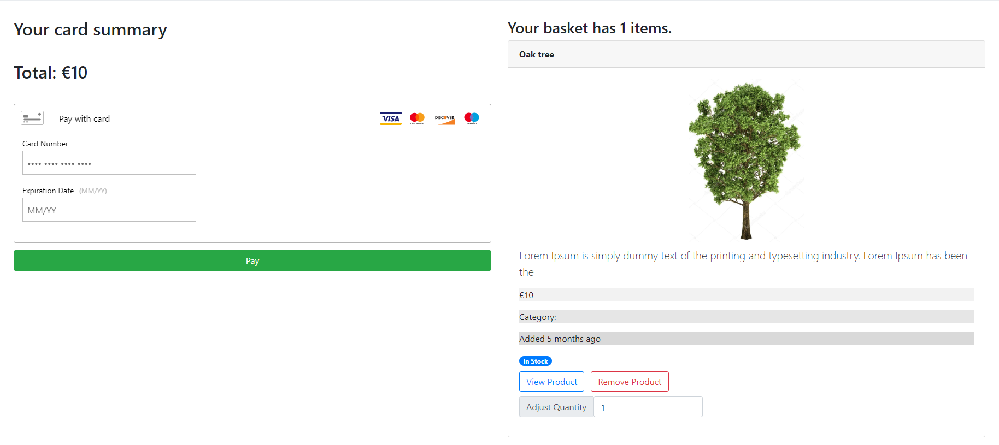

###Ecommerce

Online shop made from scratch with credit card payments.

---

###Frontend

React.js, CSS/HTML, Bootstrap

---

###Backend

Node.js, Express.js, MongoDB. Shop has admin and user routes which gives option of adding categories and products.

---

###Features

Some of the shop features: create account, login, user authentication, search for products using search bar and category filters or price filters, see most popular products or newest products, add product to card, remove product from card.

Filter by categories or price range

Card summary

User Dashboard

#Responsiveness

Page is fully responsive.

---

#Future Features

Edit user profile, purchase history, PayPal payments, manage orders and products by admin.
